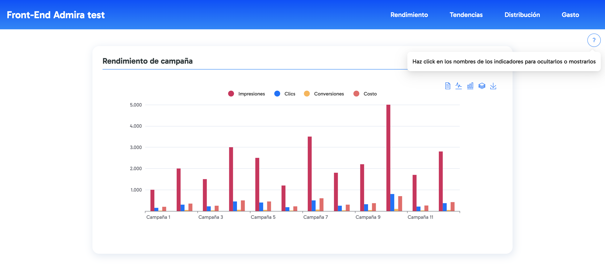
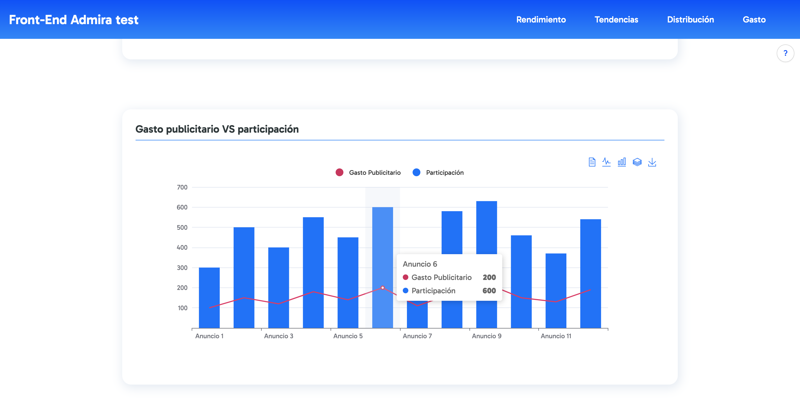
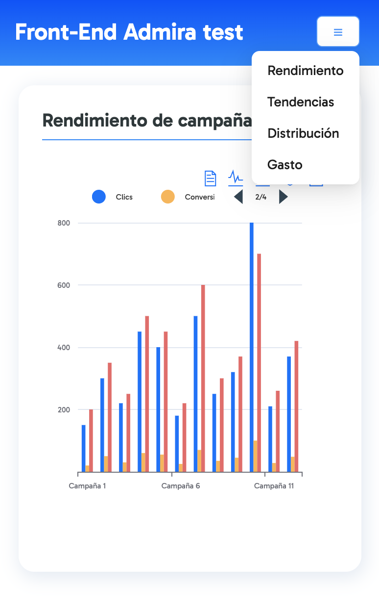
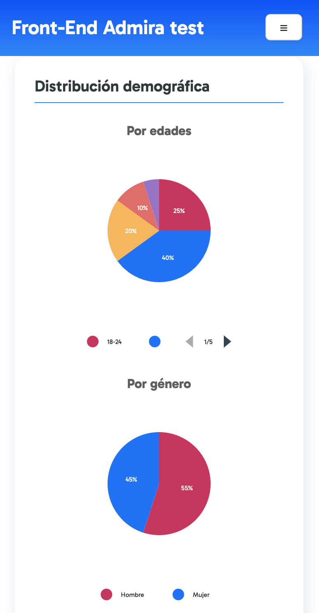

# Front-end Admira Task - Andrés Hernández

### Instrucciones de configuración:

Para configurar y ejecutar el proyecto, utiliza los siguientes comandos:

```bash
npm i        # Instalar dependencias
npm run dev  # Iniciar el proyecto en modo desarrollo
```


Este proyecto fue desarrollado utilizando **React 18^**, **Next.js**, **Ant Design** y
**Styled-Components**.

El diseño se centra en proporcionar un contraste visual a las gráficas mediante el uso de una
tarjeta (Card) y colores primarios, combinados con el color principal de Admira. Además, se han
respetado las proporciones y tamaños adecuados para asegurar una correcta visualización en
dispositivos móviles.

 _Versión escritorio con tooltip._

 _Visualización de datos con hover sobre la gráfica._

 _Versiones
móbiles._

## Acerca de las gráficas utilizadas:

El proyecto emplea **Echarts**, una biblioteca ampliamente utilizada para visualizar datos mediante
gráficos, en combinación con **React**. Los componentes `<Bar>` y `<Pie>` están diseñados para
mostrar configuraciones específicas en el navegador, tales como:

- Cambiar la vista entre líneas o barras.
- Descargar el gráfico como imagen en formato **SVG**.
- Visualizar los datos representados en formato **CSV**.

Las gráficas utilizan dos ejes principales:

- **xAxisData**: Representa los datos en el eje X.
- **Series**: Muestra los datos en el eje Y.

Estas funcionalidades ofrecen una experiencia de usuario sencilla y flexible para la interacción con
los datos representados gráficamente.
